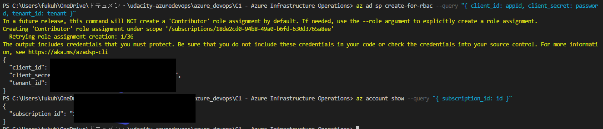

# Azure Infrastructure Operations Project: Deploying a scalable IaaS web server in Azure

### Introduction
Packer template and a Terraform template to deploy a customizable, scalable web server in Azure.

### Dependencies
1. Create an [Azure Account](https://portal.azure.com) 
2. Install the [Azure command line interface](https://docs.microsoft.com/en-us/cli/azure/install-azure-cli?view=azure-cli-latest)
3. Install [Packer](https://www.packer.io/downloads)
4. Install [Terraform](https://www.terraform.io/downloads.html)

### Instructions
1. Policy definition  
Define a tag-required policy in azure

2. Sign in with a service principal  
    >az login --service-principal -u <app-url> -p <password-or-cert> --tenant <tenant> 

3. create a server image included application  by Parcker   
Create an Ubuntu-based image with an embedded shell script that launches a static web service and register it as a custom image on Azure  
    >packer servier.json

4.  Infrastructure as code by terraform 
    - Initializes the working directory 
    >terraform init
    - View execution plan
    > terraform plan   
    - Create / edit / delete resources according to the tf file in the working directory 
    >terraform apply
    - The created resource will be deleted
    >terraform destroy 

      

## Detail 　
### tagging policy  
- Define a policy that requires tagging of resources. Predefined policies are displayed in 
    >az policy assingment list

    
    
If there is no tag, the resource will not be created.
    

### Sign in with a service principal 
- Authenticate to Azure using the service principal
- A service principal is a security ID that you can use in your applications, services, and automation tools.
- Create a service principal with "az ad sp create-for-rbac" and output the credentials required by Packer.

- Input to parcker via environment variables.

### packer run  
- Run Packer with the image template defined in Json as input.

The image was output to the specified resource group.

### Infrastructure as code by terraform
#### var.tf  
- The following are variables
    - Number of VMs
    - Prefix to make the resource name unique. Also used for tag names
    - VM username and password
    - Service principal information

#### main.tf
- Multiple VMs with availability sets can be deployed in private subnet
- The virtual machine is generated from the prepared custom image.　　
- Virtual machines are load balanced by a public load balancer.　　
- Inbound does not allow communication except on port 80. (NSG)　　

#### Run
- init 

- plan

- apply

### Output
- public loadbalancer

- topology by network watcher
 
- all resource defiend by terraform 

- All virtual machines are tagged with the project name.

- The network security group explicitly denies inbound traffic from the internet except port 80 

